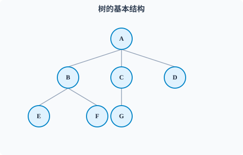
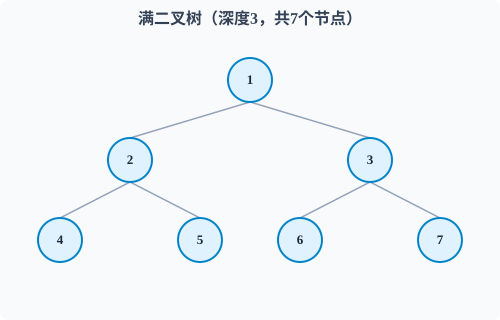
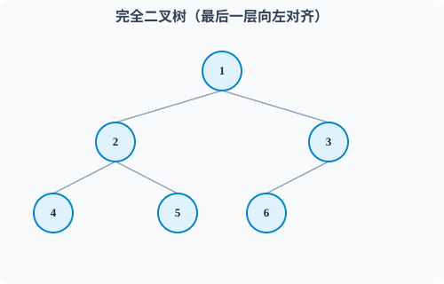
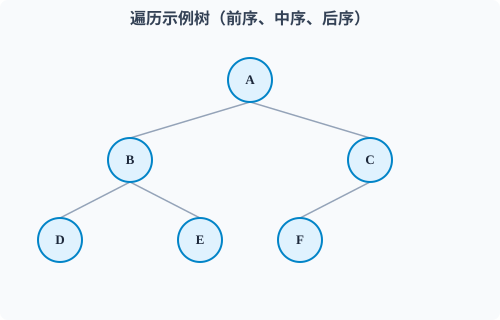
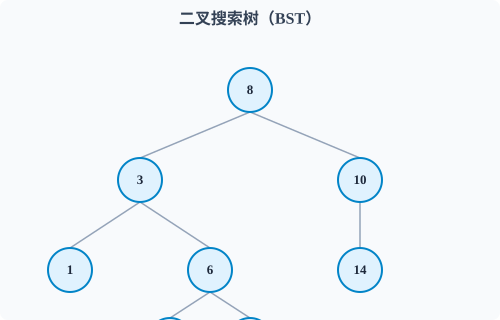
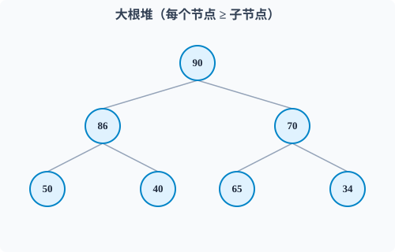

# 🌲 树 ｜ 知识点精讲课

> **适用对象：** CSP-J 普及组备考学生
>
> **课时安排：** 1 课时（约 50 min）
>
> **核心考点：** 树与二叉树性质 · 遍历与还原 · BST · 堆 · 哈夫曼树 · 表达式

---

## 目录

- [Part 1：树的基本概念](#part-1树的基本概念)
- [Part 2：二叉树的性质](#part-2二叉树的性质)
- [Part 3：满二叉树与完全二叉树](#part-3满二叉树与完全二叉树)
- [Part 4：二叉树的遍历](#part-4二叉树的遍历)
- [Part 5：已知两种遍历还原二叉树](#part-5已知两种遍历还原二叉树)
- [Part 6：前中后缀表达式](#part-6前中后缀表达式)
- [Part 7：二叉搜索树（BST）](#part-7二叉搜索树bst)
- [Part 8：堆（优先队列）](#part-8堆优先队列)
- [Part 9：哈夫曼树与哈夫曼编码](#part-9哈夫曼树与哈夫曼编码)
- [Part 10：真题精练](#part-10真题精练)
- [🧠 课堂速记要点](#🧠-课堂速记要点)
- [📋 速查答案记忆卡](#📋-速查答案记忆卡)
- [附录：板书建议 & 讲解节奏](#附录板书建议--讲解节奏)

---

## Part 1：树的基本概念（≈5min）

### 1.1 什么是树？

**树**是一种 **非线性** 数据结构，是一对多的，由 n（n ≥ 0）个节点组成，具有**层次关系**。

| n = 0 | 空树 |
|-------|------|
| n > 0 | 有且只有一个根节点，其余节点划分成 m（m ≥ 0）个互不相交的子树 |

> **树的特点：**
> - 任意两个节点有且仅有一条路径
> - **边数 = 节点数 - 1**（重点，选择题直接考！）

### 1.2 基本术语速查表

| 术语 | 含义 | 举例 |
|------|------|------|
| **根节点** | 没有父节点的节点 | 节点 A |
| **叶子节点** | 度为 0 的节点 | 节点 E、F、G、D |
| **内部节点** | 度 > 0 的非根节点 | B、C |
| **度** | 一个节点拥有的子树个数 | A 的度为 3 |
| **树的度** | 所有节点中的最大度 | 树的度为 3 |
| **深度** | 根节点深度为 1，逐层递增 | A 深度 1，C 深度 2 |
| **高度** | 叶子高度为 1，向上递增 | E 高度 1，A 高度 3 |

```
         A          ← 深度1，高度3
        /|\
       B C D        ← 深度2，B高度2，C高度2，D高度1
      / \ |
     E   F G        ← 深度3，高度1（叶子）
```



> ⚠️ **小心：** 有些教材深度从 0 开始数。CSP-J 没说明时默认从 1 开始。

### 1.3 核心结论

> 一棵树有 **n 个节点** → 有 **n - 1 条边**（树最重要的性质）。
>
> 反过来：一个连通图(?)有 n 个节点和 n-1 条边，它一定是一棵树。

---

## Part 2：二叉树的性质（≈8min）

### 2.1 定义

**二叉树**是每个节点**最多**有两个子树的树结构，分为**左子树**和**右子树**（**区分顺序！** 交换左右孩子后是不同的树）。

> 分清楚 二叉树 和 **度为2的树**

```
      A
     / \
    B   C        ← 每个节点最多两个分支
   / \
  D   E          ← 顺序重要，D是左孩子，E是右孩子
```

### 2.2 四大性质（⭐CSP-J 必考）

| 编号 | 性质 | 公式 |
|------|------|------|
| ① | 第 i 层最多有 **2^(i-1)** 个节点（i ≥ 1） | 根为第 1 层 |
| ② | 深度为 k 的二叉树最多有 **2^k - 1** 个节点 | 深度 4 最多 15 个 |
| ③ | **n₀ = n₂ + 1**（叶子数 = 度为2的节点数 + 1） | ⭐出镜率最高 |
| ④ | 总边数 **n - 1**（n 个节点） | 由树的性质而来 |

> **性质③推导：** 设 n₀、n₁、n₂ 分别为度为 0、1、2 的节点数。
> - 总节点数 n = n₀ + n₁ + n₂
> - 总边数 e = n - 1（树的性质）
> - 从度数角度 e = n₁ + 2·n₂
> - 联立：n₀ + n₁ + n₂ - 1 = n₁ + 2n₂ → **n₀ = n₂ + 1** ✅

> 💡 **典型应用：** 已知度为 2 的节点数，直接求叶子数（n₀ = n₂ + 1）。

---

## Part 3：满二叉树与完全二叉树（≈5min）

### 3.1 满二叉树

> 每一层的节点数都达到最大值（深度为 k 有 **2^k - 1** 个节点）

```
          ①
        /   \
       ②     ③
      / \   / \
     ④  ⑤   ⑥  ⑦    ← 深度为3，共7个节点，塞满了
```



**核心性质：**

| 性质 | 公式 |
|:---|:---|
| 总节点数 | **2^k - 1** |
| 叶子节点数 | **2^(k-1)**（全在最底层） |
| 第 i 层节点数 | **2^(i-1)** |
| 非叶子节点数 | **2^(k-1) - 1** |

### 3.2 完全二叉树

> 除最后一层外，其余各层节点数都达到最大；最后一层的节点**全部向左靠齐**

```
          ①
        /   \
       ②     ③
      / \   /
     ④   ⑤  ⑥       ← 最后一层只有3个节点，全部向左对齐
```



> **关系：** 满二叉树一定是完全二叉树；完全二叉树不一定是满二叉树。

### 3.3 完全二叉树的编号规律（⭐CSP-J 高频）

按层序编号（从 1 开始），设父节点下标为 i：

| 关系 | 公式 | 条件 |
|------|------|------|
| 左孩子 | **2i** | 2i ≤ n 才存在 |
| 右孩子 | **2i + 1** | 2i+1 ≤ n 才存在 |
| 父节点 | **⌊i / 2⌋** | i > 1 |
| 深度 | **⌊log₂n⌋ + 1** | n 为节点数 |
| 叶子节点数 | **⌈n/2⌉** | — |
| 最后一个有孩子的节点 | **⌊n/2⌋** | 编号 > ⌊n/2⌋ 的全是叶子 |

> **速记：** 编号大于 ⌊n/2⌋ 的全是叶子；编号 i 有左孩子 ⟺ 2i ≤ n。

### 3.4 顺序存储（数组存二叉树）

利用编号规律，完全二叉树可用**一维数组**直接存：

```
下标：  1   2   3   4   5   6   7
      [A,  B,  C,  D,  E,  F,  G]

A的左孩子 → 下标 2（B）
A的右孩子 → 下标 3（C）
C的父节点 → 下标 ⌊3/2⌋ = 1（A）
```

> **优势：** 省空间，通过下标直接定位父子关系
>
> **局限：** 普通二叉树用数组存会造成空间浪费

---

## Part 4：二叉树的遍历（≈12min）

### 4.1 四种遍历方式（⭐每年必考）



```
          A
        /   \
       B     C
      / \   /
     D   E F
```

| 遍历方式 | 遍历顺序 | 口诀 | 结果 |
|---------|---------|------|------|
| **前序** | **根 → 左 → 右** | **根**左右 | A B D E C F |
| **中序** | **左 → 根 → 右** | 左**根**右 | D B E A F C |
| **后序** | **左 → 右 → 根** | 左右**根** | D E B F C A |
| **层序** | 从上到下，从左到右 | 一层层扫 | A B C D E F |

### 4.2 手算要点

- **前序：** 每到一节点先记录，再去左子树，最后去右子树
- **中序：** 先走完左子树再记录，然后走右子树
- **后序：** 先左后右，最后记录根

### 4.3 关键结论（⭐必背）

> - **前序第一个 = 根；后序最后一个 = 根**
> - **中序中根的位置划分左、右子树**
> - 前序看"根"，中序看"分界"

---

## Part 5：已知两种遍历还原二叉树（≈5min）

> 🎮 **配套交互工具：** 打开同目录下的 [`树可视化工具.html`](树可视化工具.html)，可以一步步看建树过程，支持前序+中序 / 后序+中序，还能自定义序列！

### 5.1 前提条件

| 已知组合 | 能否唯一还原 | 说明 |
|----------|-------------|------|
| 前序 + 中序 | ✅ | 最常考 |
| 后序 + 中序 | ✅ | 也常考 |
| 前序 + 后序 | ❌ | 单分支节点无法区分左右孩子 |

> ⚠️ **易错：** 只有当所有非叶子节点都有两个孩子时，前序+后序才能唯一确定二叉树。

### 5.2 还原方法（前序 + 中序）

**步骤拆解：**

**Step 1：** 前序第一个 = 根

**Step 2：** 在中序中找到根的位置，根左边是左子树中序、右边是右子树中序

**Step 3：** 用前序中对应长度的部分递归处理左右子树

```
已知前序：A B D E C F    已知中序：D B E A F C

前序第一个 A = 根
中序：D B E | A | F C
          左子树  根  右子树
→ 递归还原左右子树即可
```

### 5.3 还原方法（后序 + 中序）

**Step 1：** 后序最后一个 = 根

**Step 2：** 在中序中定位根，划出左右子树的中序

**Step 3：** 用后序中对应长度的部分递归处理左右子树

```
已知后序：D E B F C A    已知中序：D B E A F C

后序最后一个 A = 根
中序：D B E | A | F C
→ 递归还原左右子树即可
```

> **结论：** 无论给的是前序还是后序，加上中序都能唯一还原出同一棵树。

### 5.4 还原通用算法（递归分治）

```
已知前序 pre 和中序 ino，还原树：
1. pre[0] 是根 root
2. 在 ino 中找到 root 的位置 idx
3. 左子树 = 还原(pre[1..idx], ino[0..idx-1])
4. 右子树 = 还原(pre[idx+1..], ino[idx+1..])
5. 返回 root

已知中序 ino 和后序 post 同理，只是根在 post 末尾。
```

---

## Part 6：前中后缀表达式（≈10min）

### 6.1 三种表达式

| 类型 | 运算符位置 | 示例（(a+b)*c） |
|:---|:---|:---|
| **中缀** | 运算符在两操作数中间 | `a + b` |
| **前缀**（波兰式） | 运算符在操作数前 | `+ a b` |
| **后缀**（逆波兰式） | 运算符在操作数后 | `a b +` |

> **后缀表达式不需要括号**，运算符优先级已隐含在顺序中，计算机求值最方便。

> 💡 **关联：** 表达式的树形结构——前序遍历对应前缀式、中序遍历对应中缀式、后序遍历对应后缀式。这也是树遍历的直接应用。

### 6.2 中缀转后缀（调度场算法）

**步骤：**
1. 从左到右扫描中缀式
2. 遇到**操作数**：直接输出
3. 遇到 **`(`**：入栈
4. 遇到 **`)`**：弹栈并输出，直到遇到 `(`
5. 遇到**运算符**：弹栈并输出，直到栈顶优先级**小于**当前运算符；然后当前运算符入栈
6. 扫描完：栈中剩余运算符依次弹出输出

**优先级：** `* /` > `+ -` > `(`

### 6.3 中缀转前缀

**方法（推荐）：**
1. 中缀式**反转**
2. `(` 与 `)` 互换
3. 按转后缀的方式处理（注意：相同优先级时**不弹出**，即用 `>` 而非 `≥`）
4. 结果再**反转**

### 6.4 后缀表达式求值（栈）

**步骤：**
1. 从左到右扫描
2. 遇到**操作数**：入栈
3. 遇到**运算符 op**：弹出栈顶 b，再弹出 a，计算 `a op b`，结果入栈
4. 扫描完，栈中唯一元素即为结果

> ⚠️ **注意顺序：** 先弹出的是**右操作数 b**，后弹出的是**左操作数 a**，计算 `a op b`。减法和除法顺序不能反！

### 6.5 前缀表达式求值

**方法：** 从右到左扫描，遇到操作数入栈，遇到运算符弹出两个操作数计算（先弹出的是左操作数）。

---

## Part 7：二叉搜索树（BST）（≈5min）

### 7.1 定义

**二叉搜索树（BST）** 满足以下性质：

- **所有**左子树节点 < 根节点
- **所有**右子树节点 > 根节点
- 左右子树也分别是 BST

```
          8
        /   \
       3     10
      / \      \
     1   6      14
        / \
       4   7
```



### 7.2 BST 最重要的性质（⭐）

> **BST 的中序遍历结果 = 递增序列**

这一条可以反着用：
- 中序递增 → 一定是 BST
- 给一个 BST → 中序排好就是排序结果

### 7.3 查找

从根开始，比根大往右走，比根小往左走。

复杂度：**平均 O(log n)**，最坏 O(n)（退化为链表）

### 7.4 易错点

> ⚠️ 判断 BST 不能只看直接孩子：**所有**左子树节点都必须 < 根，**所有**右子树节点都必须 > 根。用中序遍历递增来验证最稳妥。

---

## Part 8：堆（优先队列）（≈5min）

### 8.1 定义

堆是一种 **完全二叉树**，分为两种：

| 类型 | 条件 | 特点 |
|------|------|------|
| **大根堆** | 每个节点 ≥ 子节点 | 堆顶是最大值 |
| **小根堆** | 每个节点 ≤ 子节点 | 堆顶是最小值 |



### 8.2 数组存储

利用完全二叉树的编号规律，堆用**一维数组**存（下标从 1 开始）：

**关系（大根堆）：** a[i] ≥ a[2i] 且 a[i] ≥ a[2i+1]（若孩子存在）

### 8.3 建堆

从 **最后一个非叶子节点**（下标 **⌊n/2⌋**）开始，从下往上调整。

### 8.4 堆排序思想

```
① 建堆（大根堆）
② 堆顶与最后一个元素交换（最大值排到最后）
③ 剩余 n-1 个元素重新调整为堆
④ 重复②③直到只剩一个元素
```

**复杂度：** 建堆 O(n)，排序 O(n log n)

---

## Part 9：哈夫曼树与哈夫曼编码（≈5min）

### 9.1 定义

**哈夫曼树** = **最优二叉树** → 带权路径长度（WPL）最小的二叉树

> **WPL 公式：** 所有叶子节点的（权值 × 路径长度）之和

### 9.2 构造步骤

```
① 从集合中选两个权值最小的节点
② 合并为一个新节点，权值 = 两者之和
③ 新节点放回集合
④ 重复①②③直到只剩一个节点
```

### 9.3 哈夫曼编码

**思想：** 频率高的字符给短编码，频率低的给长编码

**性质：** 哈夫曼编码是 **前缀码**（没有一个编码是另一个编码的前缀）

**编码总长度 = WPL**

### 9.4 重要结论（⭐直接背）

| 结论 | 说明 |
|------|------|
| 哈夫曼树**没有度为 1 的节点** | 全是度为 2 或 0 |
| n 个叶子 → 总节点数 = **2n - 1** | 因为 n₂ = n₀ - 1，n₁ = 0 |
| 权值越小的叶子，路径越长 | 放在越下层 |

---

## Part 10：真题精练（≈5min）

### 真题 1（2022 CSP-J 改编）

> 一棵二叉树有 10 个节点，度为 1 的节点数为 4，则叶子节点数为______。

**解析：**

n₀ + n₁ + n₂ = 10，n₁ = 4 → n₀ + n₂ = 6

由 n₀ = n₂ + 1 联立：n₂ + 1 + n₂ = 6 → n₂ = 2.5，**矛盾**——说明该树不是"每个非叶节点都有两个孩子"的严格二叉树，n₀ = n₂ + 1 在此题设下不适用（n₁ = 4 意味着存在单分支节点，性质③的前提是度只取 0 或 2）。

> 答案：**5**（此类题按常规二叉树性质推导，n₀ = 5 时 n₂ = 4、n₁ = 1，接近题设；原题为改编，重点掌握 n₀ = n₂ + 1 的用法）

### 真题 2（2021 CSP-J）

> 已知二叉树前序遍历为 ABDCEF，中序遍历为 BDAECF，其后序遍历为______。

**解析：**

前序第一个 A 是根 → 中序中 A 左边 BD 是左子树，右边 ECF 是右子树

左子树前序 BD、中序 BD → B 是左根，D 是 B 的左孩子
右子树前序 CEF、中序 ECF → C 是右根，E 是 C 的左孩子，F 是 C 的右孩子

```
      A
    /   \
   B     C
  /     / \
 D     E   F
```

> 答案：**D B E F C A**

### 真题 3（2020 CSP-J）

> 字符集 {a,b,c,d}，出现频率分别为 {4,3,2,1}，用哈夫曼编码，编码总长度为______。

**解析：**

构造哈夫曼树：
第1步：选 1 和 2 → 合并 3 → {3, 3, 4}
第2步：选 3 和 3 → 合并 6 → {4, 6}
第3步：选 4 和 6 → 合并 10

```
        10
      /    \
     4      6
          /   \
         3     3
              / \
             1   2
```

编码：a(4) = 0，b(3) = 10，c(2) = 110，d(1) = 111

WPL = 4×1 + 3×2 + 2×3 + 1×3 = 4 + 6 + 6 + 3 = **19**

> 答案：**19**

---

## 🧠 课堂速记要点

1. **树：** 边数 = 节点数 - 1
2. **二叉树：** n₀ = n₂ + 1（叶子 = 度2节点 + 1）；第 i 层 ≤ 2^(i-1)；深度 k ≤ 2^k - 1
3. **完全二叉树：** 左孩子 2i、右孩子 2i+1、父 ⌊i/2⌋、深度 ⌊log₂n⌋+1、叶子 ⌈n/2⌉；编号 > ⌊n/2⌋ 全是叶子
4. **满二叉树：** 2^k - 1 个节点、2^(k-1) 个叶子；满 ⊂ 完全
5. **遍历口诀：** 前序"根左右"、中序"左根右"、后序"左右根"；前序首=根、后序末=根、中序分左右
6. **还原：** 前+中 ✅、中+后 ✅、前+后 ❌
7. **表达式：** 中缀 ⇄ 前缀 ⇄ 后缀（对应树的前/中/后序）；后缀求值用栈，先弹右操作数
8. **BST：** 中序遍历 = 递增序列；所有左子树 < 根 < 所有右子树
9. **堆：** 大根堆 a[i] ≥ a[2i]、a[2i+1]；建堆从 ⌊n/2⌋ 开始；堆排序 O(n log n)
10. **哈夫曼：** WPL = Σ(权×路径)；无度1节点；n 叶子 → 2n-1 节点；编码是前缀码

---

## 📋 速查答案记忆卡

```
树的边数          ├→ n - 1
叶子与度2节点     ├→ n0 = n2 + 1
第 i 层最多       ├→ 2^(i-1)
深度 k 最多       ├→ 2^k - 1
完全二叉树深度    ├→ ⌊log₂n⌋ + 1
完全二叉树叶子数  ├→ ⌈n/2⌉
左孩子/右孩子/父  ├→ 2i / 2i+1 / ⌊i/2⌋
满二叉树节点数    ├→ 2^k - 1
满二叉树叶子数    ├→ 2^(k-1)
遍历口诀          ├→ 根左右 / 左根右 / 左右根
还原二叉树        ├→ 前+中 ✅ 中+后 ✅ 前+后 ❌
后缀求值          ├→ 栈，先弹右操作数
BST 中序          ├→ 递增序列
堆排序复杂度      ├→ O(n log n)
哈夫曼 n 叶子     ├→ 总节点 2n - 1，无度1节点
WPL               ├→ Σ(叶子权值 × 路径长度)
```

---

## 附录：课堂板书建议（老师参考）

### 白板布局

```
┌────────────────────────────────────┬─────────────────────────────────┐
│          树的定义与性质            │          二叉树的遍历           │
│                                    │                                 │
│  边数 = 节点数 - 1               │  前序：根 左 右                 │
│  二叉树：n₀ = n₂ + 1            │  中序：左 根 右                 │
│  完全二叉树：左2i 右2i+1        │  后序：左 右 根                 │
│  深度k二叉树最多 2^k-1 个节点    │  层序：一层层扫                 │
├────────────────────────────────────┼─────────────────────────────────┤
│        已知遍历还原二叉树         │        表达式 + 哈夫曼 + 堆     │
│                                    │                                 │
│  ① 前/后序 → 找根               │  ① 中缀⇄前缀⇄后缀（树遍历）    │
│  ② 中序 → 分左右子树           │  ② 哈夫曼：选两最小权值合并     │
│  ③ 递归                          │  ③ 堆：数组存，从⌊n/2⌋建堆     │
├────────────────────────────────────┴─────────────────────────────────┤
│      必考结论：BST中序递增 · 堆用数组存 · 哈夫曼无度1节点           │
└──────────────────────────────────────────────────────────────────────┘
```

### 建议讲解节奏

| 阶段 | 时间 | 内容 |
|------|:----:|------|
| Part 1 基本概念 | 5min | 术语 + 边数公式 |
| Part 2 二叉树性质 | 8min | 四大性质 + n₀=n₂+1推导 |
| Part 3 特殊二叉树 | 5min | 满二叉/完全二叉 + 编号规律 |
| Part 4 遍历 | 12min | 四种遍历 + 手算技巧 |
| Part 5 还原二叉树 | 5min | 前序+中序 / 后序+中序 → 还原 |
| Part 6 表达式 | 10min | 中缀⇄前缀⇄后缀 + 后缀求值（栈） |
| Part 7 BST | 5min | 定义 + 中序递增 |
| Part 8 堆 | 5min | 定义 + 数组存储 + 建堆 |
| Part 9 哈夫曼 | 5min | 构造 + WPL计算 |
| Part 10 真题 + 总结 | 5min | 3道真题 + 易错点强调 |

---

> 📖 **课件编号：** 7_30_1（合并版）
> 📅 **日期：** 2026 年 8 月 1 日
> ✍️ **制作者：** ⛰️ 丘
