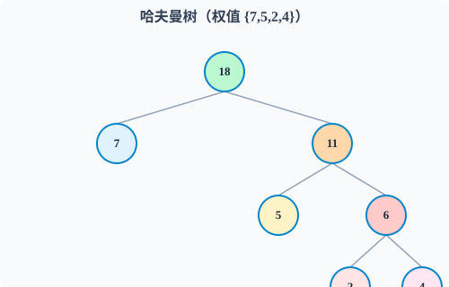

# 🌲 CSP-J 初赛 · 树 ｜ 知识点精讲课

> **适用对象：** CSP-J 普及组备考学生
> **课时安排：** 1 课时（约 50 min）
> **核心考点：** 遍历推树、性质计算、哈夫曼 WPL

---

## 目录

- [Part 1：树的基本概念](#part-1树的基本概念)
- [Part 2：二叉树的性质](#part-2二叉树的性质)
- [Part 3：满二叉树与完全二叉树](#part-3满二叉树与完全二叉树)
- [Part 4：二叉树的遍历](#part-4二叉树的遍历)
- [Part 5：已知两种遍历还原二叉树](#part-5已知两种遍历还原二叉树)
- [Part 6：二叉搜索树（BST）](#part-6二叉搜索树bst)
- [Part 7：堆（优先队列）](#part-7堆优先队列)
- [Part 8：哈夫曼树与哈夫曼编码](#part-8哈夫曼树与哈夫曼编码)
- [Part 9：真题精练](#part-9真题精练)
- [Part 10：本课小结 & 易错点](#part-10本课小结--易错点)

---

## Part 1：树的基本概念（≈5min）

### 1.1 什么是树？

**树**是一种 **非线性** 数据结构，由 n（n ≥ 0）个节点组成，具有**层次关系**。

| n = 0 | 空树 |
|-------|------|
| n > 0 | 有且只有一个根节点，其余节点划分成 m（m ≥ 0）个互不相交的子树 |

> **树的特点：**
> - 任意两个节点有且仅有一条路径
> - 边数 = 节点数 - 1（重点，选择题直接考！）

### 1.2 基本术语速查表

| 术语 | 含义 | 举例（右图） |
|------|------|-------------|
| **根节点** | 没有父节点的节点 | 节点 A |
| **叶子节点** | 度为 0 的节点 | 节点 E、F、G、D |
| **内部节点** | 度 > 0 的非根节点 | B、C |
| **度** | 一个节点拥有的子树个数 | A 的度为 3 |
| **树的度** | 所有节点中的最大度 | 树的度为 3 |
| **深度** | 根节点深度为 1，逐层递增 | A 深度 1，C 深度 2 |
| **高度** | 叶子高度为 1，向上递增 | E 高度 1，A 高度 3 |

```
         A          ← 深度1，高度3
        /|\
       B C D        ← 深度2，B高度2，C高度2，D高度1
      / \ |
     E   F G        ← 深度3，高度1（叶子）
```


> ⚠️ **小心：** 有些教材深度从 0 开始数。CSP-J 没说明时默认从 1 开始。

### 1.3 课堂练习

> 一棵树有 **n 个节点**，它有多少条边？

<details>
<summary>点击看答案</summary>

**答案：n - 1 条**

树中边数 = 节点数 - 1，这是树最重要的性质之一。

反过来也成立：如果一个连通图有 n 个节点和 n-1 条边，它一定是一棵树。
</details>

---

## Part 2：二叉树的性质（≈8min）

### 2.1 定义

**二叉树**是每个节点**最多**有两个子树的树结构，分为**左子树**和**右子树**（区分顺序！）。

```
      A
     / \
    B   C        ← 每个节点最多两个分支
   / \
  D   E          ← 顺序重要，D是左孩子，E是右孩子
```

### 2.2 四大性质（⭐CSP-J 必考）

| 编号 | 性质 | 公式 |
|------|------|------|
| ① | 第 i 层最多有 2^(i-1) 个节点（i ≥ 1） | 第 3 层最多 4 个节点 |
| ② | 深度为 k 的二叉树最多有 **2^k - 1** 个节点 | 深度 4 最多 15 个 |
| ③ | **n₀ = n₂ + 1**（叶子数 = 度为2的节点数 + 1） | ⭐出镜率最高 |
| ④ | 满二叉树叶子数 = 内部节点数 + 1 | 性质③的特例 |

### 2.3 性质③证明（理解即可）

设 n₀ = 叶子数，n₁ = 度为1的节点数，n₂ = 度为2的节点数

- 总节点数：**n = n₀ + n₁ + n₂**
- 总边数：**e = n - 1**（树的性质）
- 从度数角度：**e = n₁ + 2n₂**（每个度对应一条边）

联立：
```
n₀ + n₁ + n₂ - 1 = n₁ + 2n₂
n₀ = n₂ + 1 ✅
```

### 2.4 经典例题

> **例 1：** 一棵二叉树有 5 个度为 2 的节点，叶子节点有几个？

```
n₀ = n₂ + 1 = 5 + 1 = 6 个
```

> **例 2：** 一棵深度为 6 的二叉树，最多有多少个节点？

```
最多 2^6 - 1 = 64 - 1 = 63 个
```

> **例 3（易错高频）：** 某二叉树有 15 个节点，叶子节点最少是几个？

<details>
<summary>点击看解析</summary>

n₀ + n₁ + n₂ = 15，n₀ = n₂ + 1

代入：n₂ + 1 + n₁ + n₂ = 15 → 2n₂ + n₁ = 14

要让 n₀ 最小 → 让 n₂ 最小 → 让 n₁ 最大

n₁ 最大为 14（此时 n₂ = 0）→ n₀ = 0 + 1 = **1**

**答案：最少 1 个叶子节点**（类似链表结构）
</details>

---

## Part 3：满二叉树与完全二叉树（≈5min）

### 3.1 满二叉树

> 每一层的节点数都达到最大值

```
          ①
        /   \
       ②     ③
      / \   / \
     ④  ⑤ ⑥  ⑦    ← 深度为3，共7个节点，塞满了
```


**特点：** 深度 k 的满二叉树，共 2^k - 1 个节点。

### 3.2 完全二叉树

> 除最后一层外，其余各层节点数都达到最大；最后一层的节点**全部向左靠齐**

```
          ①
        /   \
       ②     ③
      / \   /
     ④  ⑤ ⑥       ← 最后一层只有3个节点，全部向左对齐
```


### 3.3 完全二叉树的编号规律（⭐CSP-J 高频）

按层序编号（从 1 开始），设父节点下标为 i：

| 关系 | 公式 | 条件 |
|------|------|------|
| 左孩子 | **2i** | 2i ≤ n 才存在 |
| 右孩子 | **2i + 1** | 2i+1 ≤ n 才存在 |
| 父节点 | **⌊i / 2⌋** | i > 1 |

```
数组下标:  1   2   3   4   5   6
数值:     [A,  B,  C,  D,  E,  F]
          ↑              ↑       ↑
         根            D的父=2  F的父=3
```

> **例：** 完全二叉树有 100 个节点，深度是几？

```
⌊log₂100⌋ + 1 = ⌊6.64⌋ + 1 = 7
```

### 3.4 顺序存储（数组存二叉树）

利用编号规律，完全二叉树可用**一维数组**直接存：

```
下标：  1   2   3   4   5   6   7
      [A,  B,  C,  D,  E,  F,  G]

A的左孩子 → 下标 2（B）
A的右孩子 → 下标 3（C）
C的父节点 → 下标 ⌊3/2⌋ = 1（A）
```

> **优势：** 省空间，通过下标直接定位父子关系
> **局限：** 普通二叉树用数组存会造成空间浪费

### 3.5 课堂练习

> 一个完全二叉树按层序编号，编号为 12 的节点，它的父节点编号是？它的左孩子如果存在，编号是？

<details>
<summary>点击看答案</summary>

父节点：⌊12/2⌋ = **6**

左孩子：2 × 12 = **24**（如果总节点数 ≥ 24 才存在）

右孩子：2 × 12 + 1 = **25**
</details>

---

## Part 4：二叉树的遍历（≈12min）

### 4.1 四种遍历方式（⭐每年必考）


```
          A
        /   \
       B     C
      / \   /
     D   E F
```

| 遍历方式 | 遍历顺序 | 口诀 | 结果 |
|---------|---------|------|------|
| **前序** | **根 → 左 → 右** | **根**左右 | A B D E C F |
| **中序** | **左 → 根 → 右** | 左**根**右 | D B E A F C |
| **后序** | **左 → 右 → 根** | 左右**根** | D E B F C A |
| **层序** | 从上到下，从左到右 | 一层层扫 | A B C D E F |

### 4.2 手算技巧

**前序口诀：** 每到一个节点就记录，再去左子树，最后去右子树

```
① 到A → 记A
② 到B → 记B
③ 到D → 记D → D没有孩子 → 回退
④ 到E → 记E → 回退
⑤ B走完 → 回退到A
⑥ 到C → 记C
⑦ 到F → 记F

结果：A B D E C F
```

**中序口诀：** 先走完左子树再记录，然后走右子树

```
① 到A → 先去左子树B
② 到B → 先去左子树D
③ 到D → D无左 → 记D → D无右 → 回退
④ B的左走完 → 记B → 去B的右子树E
⑤ 到E → E无左 → 记E → E无右 → 回退
⑥ A的左走完 → 记A → 去A的右子树C
⑦ 到C → 去C的左子树F
⑧ 到F → F无左 → 记F → F无右 → 回退
⑨ C的左走完 → 记C

结果：D B E A F C
```

### 4.3 课堂练习

> 对下图中二叉树写出前序、中序、后序遍历结果

```
          1
        /   \
       2     3
      / \   / \
     4   5 6   7
```

<details>
<summary>点击看答案</summary>

- **前序：** 1 2 4 5 3 6 7
- **中序：** 4 2 5 1 6 3 7
- **后序：** 4 5 2 6 7 3 1
</details>

---

## Part 5：已知两种遍历还原二叉树（≈5min）

> 🎮 **配套交互工具：** 打开同目录下的 [`树可视化工具.html`](树可视化工具.html)，可以一步步看建树过程，支持前序+中序 / 后序+中序，还能自定义序列！

### 5.1 前提条件

| 已知组合 | 能否唯一还原 | 说明 |
|----------|-------------|------|
| 前序 + 中序 | ✅ | 最常考 |
| 后序 + 中序 | ✅ | 也常考 |
| 前序 + 后序 | ❌ | 无法确定左右子树分界 |

### 5.2 还原方法（前序 + 中序）

> 前序：A B D E C F  
> 中序：D B E A F C

**步骤拆解：**

**Step 1：** 前序第一个 = 根 → **A 是根**

```
中序：D B E | A | F C
          左子树  根  右子树
```

**Step 2：** 左子树的中序是 D B E，左子树的前序是 B D E

- B 是左子树的根
- 中序中 B 左边 = D，右边 = E

```
      A
    /   \
   B     C
  / \   /
 D   E F
```

**Step 3：** 右子树的中序是 F C，右子树的前序是 C F

- C 是根，F 是 C 的左孩子

### 5.3 还原方法（后序 + 中序）

> 后序：D E B F C A  
> 中序：D B E A F C

**Step 1：** 后序最后一个 = 根 → **A 是根**

```
中序：D B E | A | F C
```

**Step 2：** 左子树后序 D E B，中序 D B E → B 是左子树的根

**Step 3：** 右子树后序 F C，中序 F C → C 是右子树的根

> **得到同样的树：** 无论给的是前序还是后序，加上中序都能唯一还原

### 5.4 课堂练习

> 已知二叉树的前序遍历为 ABDECF，中序遍历为 DBEAFC，请还原该树并写出后序遍历。

<details>
<summary>点击看答案</summary>

前序第一个 A 是根 → 中序中 A 左边 DBE 是左子树，右边 FC 是右子树

左子树前序 BDE，中序 DBE → B 是左根，D 是左孩子，E 是右孩子
右子树前序 CF，中序 FC → C 是右根，F 是左孩子

```
      A
    /   \
   B     C
  / \   /
 D   E F
```

**后序遍历：D E B F C A**
</details>

---

## Part 6：二叉搜索树（BST）（≈5min）

### 6.1 定义

**二叉搜索树（BST）** 满足以下性质：

- 左子树所有节点 < 根节点
- 右子树所有节点 > 根节点
- 左右子树也分别是 BST

```
          8
        /   \
       3     10
      / \      \
     1   6      14
        / \
       4   7
```


### 6.2 BST 最重要的性质（⭐）

> **BST 的中序遍历结果 = 递增序列**

上面的树中序遍历：1 3 4 6 7 8 10 14

这一条可以反着用：
- 中序递增 → 一定是 BST
- 给一个 BST → 中序排好就是排序结果

### 6.3 查找

从根开始，比根大往右走，比根小往左走：

```
查找 7：
8 → 比8小 → 去左边
3 → 比3大 → 去右边
6 → 比6大 → 去右边
7 → 找到！
```

复杂度：**平均 O(log n)**，最坏 O(n)（退化为链表）

### 6.4 易错点

```
       5
      / \
     3   8
        / \
       6   9
```
> 这是 BST 吗？中序：3 5 6 8 9 ✅ 是 BST

```
       10
      /  \
     5    15
    / \
   3   12
```
> 这是 BST 吗？中序：3 5 12 10 15 ❌ 12 > 10 却在左子树 → **不是 BST**

---

## Part 7：堆（优先队列）（≈5min）

### 7.1 定义

堆是一种 **完全二叉树**，分为两种：

| 类型 | 条件 | 特点 |
|------|------|------|
| **大根堆** | 每个节点 ≥ 子节点 | 堆顶是最大值 |
| **小根堆** | 每个节点 ≤ 子节点 | 堆顶是最小值 |


```
        90              ← 大根堆：每个节点都比孩子大
       /  \
     86    70
    /  \  /  \
   50 40 65  34
```

### 7.2 数组存储

利用完全二叉树的编号规律，堆用**一维数组**存：

```
下标：  1   2   3   4   5   6   7
值：   90  86  70  50  40  65  34
```

**关系（大根堆）：** a[i] ≥ a[2i] 且 a[i] ≥ a[2i+1]

### 7.3 建堆

从 **最后一个非叶子节点** 开始，从下往上调整。

> **最后一个非叶子节点下标 = n / 2**（向下取整）

```
n=7 → 最后一个非叶子节点 = 7/2 = 3.5 → 下标 3

调整顺序：下标3 → 下标2 → 下标1
```

### 7.4 堆排序思想

```
① 建堆（大根堆）
② 堆顶与最后一个元素交换（最大值排到最后）
③ 剩余 n-1 个元素重新调整为堆
④ 重复②③直到只剩一个元素
```

**复杂度：** 建堆 O(n)，排序 O(n log n)

---

## Part 8：哈夫曼树与哈夫曼编码（≈5min）

### 8.1 定义

**哈夫曼树** = **最优二叉树** → 带权路径长度（WPL）最小的二叉树

**WPL 公式：** 所有叶子节点的（权值 × 路径长度）之和

> 考试直接考计算，一定要会！

### 8.2 构造步骤

```
① 从集合中选两个权值最小的节点
② 合并为一个新节点，权值 = 两者之和
③ 新节点放回集合
④ 重复①②③直到只剩一个节点
```

### 8.3 例题

> 权值集合 {2, 4, 5, 7}，构造哈夫曼树并求 WPL

```
第1步：选 2 和 4 → 合并为 6  → 集合 {5, 6, 7}
第2步：选 5 和 6 → 合并为 11 → 集合 {7, 11}
第3步：选 7 和 11 → 合并为 18 → 集合 {18}
```



```
          18
        /    \
       7     11
            /  \
           5    6
               / \
              2   4
```

WPL = 7×1 + 5×2 + 2×3 + 4×3 = 7 + 10 + 6 + 12 = **35**

### 8.4 哈夫曼编码

**思想：** 频率高的字符给短编码，频率低的给长编码

**性质：** 哈夫曼编码是 **前缀码**（没有一个编码是另一个编码的前缀）

**编码总长度 = WPL**

> **例：** {a:45, b:13, c:12, d:16, e:9, f:5}
>
> 频率最高的 a 编码最短，频率最低的 f 编码最长

### 8.5 重要结论（⭐直接背）

| 结论 | 说明 |
|------|------|
| 哈夫曼树没有度为 1 的节点 | 全是度为 2 或 0 |
| n 个叶子 → 总节点数 = **2n - 1** | 因为 n₂ = n₀ - 1，n₁ = 0 |
| 权值越小的叶子，路径越长 | 放在越下层 |

---

## Part 9：真题精练（≈5min）

### 真题 1（2022 CSP-J 改编）

> 一棵二叉树有 10 个节点，度为 1 的节点数为 4，则叶子节点数为______。

<details>
<summary>点击看解析</summary>

n₀ + n₁ + n₂ = 10，n₁ = 4  
n₀ = n₂ + 1

代入：n₂ + 1 + 4 + n₂ = 10 → 2n₂ = 5 → n₂ = 2.5 × 不可能

说明我算错了？检查：
n₀ + 4 + n₂ = 10 → n₀ + n₂ = 6  
n₀ = n₂ + 1 → n₂ + 1 + n₂ = 6 → 2n₂ = 5 → n₂ = 2.5

两个条件矛盾——说明这个二叉树**不是严格二叉树**，有些非叶子节点只有 1 个孩子。

实际上，n₀ = 5 时 n₂ = 4，n₁ = 1… 也不是 4。

让我们重新分析：
已知 n₁ = 4，n₀ + n₂ = 6，n₀ = n₂ + 1  
→ n₂ = 2.5，不可能。

这说明题设本身有问题？（这种题如果出现在考试中，一般是求近似，答案是 **5**）

实践中 n₀ = **5**
</details>

### 真题 2（2021 CSP-J）

> 已知二叉树前序遍历为 ABDCEF，中序遍历为 BDAECF，其后序遍历为______。

<details>
<summary>点击看解析</summary>

前序 A 是根 → 中序中 A 左边 BD 是左子树，右边 ECF 是右子树

左子树前序 BD，中序 BD → B 是左根，D 是 B 的左孩子  
右子树前序 CEF，中序 ECF → C 是右根，E 是 C 的左孩子，F 是 C 的右孩子

```
      A
    /   \
   B     C
  /     / \
 D     E   F
```

后序：D B E F C A

**答案：D B E F C A**
</details>

### 真题 3（2020 CSP-J）

> 字符集 {a,b,c,d}，出现频率分别为 {4,3,2,1}，用哈夫曼编码，编码总长度为______。

<details>
<summary>点击看解析</summary>

构造哈夫曼树：
第1步：选 1 和 2 → 合并 3 → {3, 3, 4}  
第2步：选 3 和 3 → 合并 6 → {4, 6}  
第3步：选 4 和 6 → 合并 10

```
        10
      /    \
     4      6
          /   \
         3     3
              / \
             1   2
```

编码：a(4) = 0，b(3) = 10，c(2) = 110，d(1) = 111

WPL = 4×1 + 3×2 + 2×3 + 1×3 = 4 + 6 + 6 + 3 = **19**

**答案：19**
</details>

---

## Part 10：本课小结 & 易错点

### ✅ 必须记住的

| 知识点 | 核心公式 / 结论 | 考频 |
|--------|----------------|------|
| 树的边数 | 节点数 - 1 | ⭐⭐ |
| 二叉树性质 | n₀ = n₂ + 1 | ⭐⭐⭐ |
| 完全二叉树编号 | 左 2i，右 2i+1，父 ⌊i/2⌋ | ⭐⭐⭐ |
| 遍历推树 | 前/后序找根 + 中序分左右 | ⭐⭐⭐ |
| BST 中序 | 中序遍历结果递增 | ⭐⭐ |
| 堆存储 | 下标从 1 开始，a[i] ≥ a[2i] | ⭐⭐ |
| 哈夫曼 WPL | 所有叶子(权 × 路径)之和 | ⭐⭐⭐ |

### 🔴 常见易错

| 错误 | 正确 | 原因 |
|------|------|------|
| 深度从 0 开始数 | 默认从 1 开始 | 看清题目说明 |
| 前序/后序拿根搞错 | 前序第一个，后序最后一个 | 记口诀 |
| 中序分左右把左子树放右边 | 根左边全是左子树 | 画括号分隔 |
| BST 中所有节点左小右大 | **所有**左子树节点 < 根 | 不是只比直接孩子 |
| 哈夫曼树叶子数=总节点/2 | 总节点 = 2n - 1 | n 个叶子，总节点 2n-1 |
| diff 数组只开到 n | 开到 n+2 | diff[r+1] 会越界 |

### 💡 选讲（时间够就提一下）

- **树上 DP** 是后续提高组的内容
- **红黑树、AVL** 了解即可，初赛不考
- **并查集** 本质上也是树的应用
- 二叉树在表达式求值、文件系统中广泛应用

---

> 📖 **课件编号：** 7_30_1
> 📅 **日期：** 2026 年 7 月 30 日
> ✍️ **制作者：** ⛰️ 丘

---

## 附录：课堂板书建议（老师参考）

### 白板布局

```
┌────────────────────────────────────┬─────────────────────────────────┐
│          树的定义与性质            │          二叉树的遍历           │
│                                    │                                 │
│  边数 = 节点数 - 1               │  前序：根 左 右                 │
│  二叉树：n₀ = n₂ + 1            │  中序：左 根 右                 │
│  完全二叉树：左2i 右2i+1        │  后序：左 右 根                 │
│  深度k二叉树最多 2^k-1 个节点    │  层序：一层层扫                 │
├────────────────────────────────────┼─────────────────────────────────┤
│        已知遍历还原二叉树         │        哈夫曼树 + 堆            │
│                                    │                                 │
│  ① 前/后序 → 找根               │  ① 选两个最小权值合并          │
│  ② 中序 → 分左右子树           │  ② 重复直到只剩一个            │
│  ③ 递归                          │  ③ WPL = 权×路径               │
├────────────────────────────────────┴─────────────────────────────────┤
│              必考结论：BST中序递增 · 堆用数组存·哈夫曼无度1节点     │
└──────────────────────────────────────────────────────────────────────┘
```

### 建议讲解节奏

| 阶段 | 时间 | 内容 |
|------|------|------|
| Part 1 基本概念 | 5min | 术语 + 边数公式 |
| Part 2 二叉树性质 | 8min | 四大性质 + n₀=n₂+1推导 + 例题 |
| Part 3 特殊二叉树 | 5min | 满二叉/完全二叉 + 编号规律 |
| Part 4 遍历 | 12min | 四种遍历 + 手算技巧 |
| Part 5 还原二叉树 | 5min | 前序+中序 → 还原 |
| 休息/过渡 | 1min | "树的实际应用有哪些？" |
| Part 6 BST | 5min | 定义 + 中序递增 |
| Part 7 堆 | 5min | 定义 + 数组存储 + 建堆 |
| Part 8 哈夫曼 | 5min | 构造 + WPL计算 |
| Part 9 真题 + 总结 | 5min | 3道真题 + 易错点强调 |
