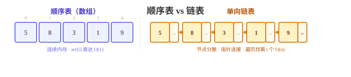
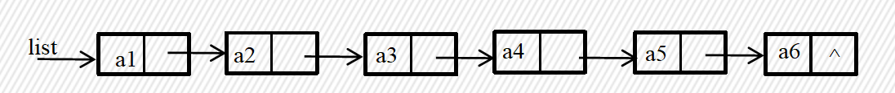
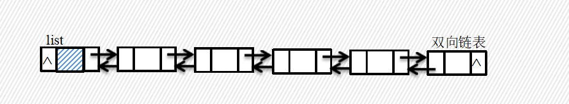
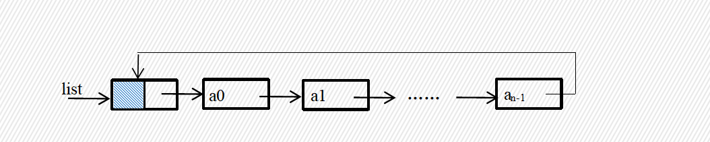

# 📖 第2章 程序设计基础知识

> 对应《信息学奥赛一本通·初赛篇》第二章
> 适用范围：CSP-J / NOIP 普及组初赛

---

## Part 1：程序基本常识

### 1.1 算法的五大特征

| 特征 | 含义 | 反例 |
|------|------|------|
| **有穷性** | 必须在有限步内结束 | 死循环 |
| **确定性** | 每步指令唯一确定、无歧义 | 模棱两可的描述 |
| **可行性** | 每一步都能在有限时间内完成 | 理论上可行但实际算不了 |
| **输入** | 有 0 个或多个输入 | — |
| **输出** | 有至少 1 个输出 | 没有结果 |

> 初赛常考：给一段描述判断是否符合算法特征，尤其爱考「有穷性」和「确定性」。

### 1.2 时间复杂度

> 算法执行时间随数据规模 `n` 增长的变化趋势，用 **大 O 表示法** 描述。

**常见复杂度排序（由快到慢）：**

```
O(1) < O(log n) < O(n) < O(n log n) < O(n²) < O(n³) < O(2ⁿ)
```

**计算规则：**
- 忽略常数：`O(3n) = O(n)`
- 只取最高阶：`O(n² + n) = O(n²)`
- 乘法规则：嵌套循环 = 各层复杂度相乘
- 加法规则：顺序执行的代码 = 取复杂度最大的部分

**典型代码复杂度：**

| 代码模式 | 复杂度 | 说明 |
|---------|--------|------|
| 单层循环 `for(i=0;i<n;i++)` | O(n) | 执行 n 次 |
| 双层 `for i→n: for j→n` | O(n²) | 两层各 n 次 |
| 双层 `for i→n: for j→i` | O(n²) | 约 n²/2（内层依赖外层） |
| 三层 `for i→n: for j→n: for k→n` | O(n³) | 三层各 n 次 |
| 二分 `while(l<r){mid=(l+r)/2}` | O(log n) | 每次规模减半 |
| 递归 `fib(n)=fib(n-1)+fib(n-2)` | O(2ⁿ) | 指数爆炸 |

### 1.3 空间复杂度

- 算法运行过程中所需的额外存储空间
- 常见：`O(1)`（原地操作）、`O(n)`（额外数组）、`O(n²)`（二维数组）
- 递归的空间复杂度 = 递归深度（额外栈空间）

### 1.4 课堂练习

> 以下哪个时间复杂度描述是错误的？
> A. O(n + n²) = O(n²)　B. O(2n) = O(n)　C. O(n² + n log n) = O(n²)　D. O(2ⁿ + n¹⁰) = O(n¹⁰)

**答案：** D。指数增长（2ⁿ）快于任何多项式（n¹⁰），所以 O(2ⁿ + n¹⁰) 应取 O(2ⁿ)。

---

## Part 2：C++ 语言基础

### 2.1 程序基本构成

```cpp
#include <iostream>   // 头文件
using namespace std;  // 命名空间

int main() {          // 主函数
    int a = 10;
    cout << a;        // 输出
    return 0;         // 返回值
}
```

- `main` 函数是程序入口，`return 0` 表示正常退出
- `cin` / `cout` 在 `<iostream>` 中定义

### 2.2 数据类型速览

| 类型 | 字节 | 范围 |
|------|------|------|
| `int` | 4 | −2³¹ ~ 2³¹−1 |
| `long long` | 8 | −2⁶³ ~ 2⁶³−1 |
| `float` | 4 | 约 ±3.4×10⁻³⁸ ~ ±3.4×10³⁸ |
| `double` | 8 | 约 ±1.7×10⁻³⁰⁸ ~ ±1.7×10³⁰⁸ |
| `char` | 1 | −128 ~ 127 / 0 ~ 255 |
| `bool` | 1 | true / false |

### 2.3 程序三种基本结构

| 结构 | C++ 语法 |
|------|---------|
| **顺序** | 代码从上往下依次执行 |
| **分支** | `if-else` / `switch-case` |
| **循环** | `for` / `while` / `do-while` |

> 初赛常考：`for` 循环的执行顺序（初始化→条件判断→循环体→迭代→条件判断……）

### 2.4 函数（三种传参方式）

```cpp
// 值传递（形参改变不影响实参）
void swap1(int a, int b) { int t = a; a = b; b = t; }

// 址传递（传指针，通过指针直接修改内存内容）
void swap3(int *pa, int *pb){
    int t = *pa;
    *pa = *pb;
    *pb = t;
}

// 引用传递（形参改变影响实参）
void swap2(int &a, int &b) { int t = a; a = b; b = t; }
```

| 方式 | 是否影响实参 | 特点 |
|------|:-----------:|------|
| 值传递 | ❌ 不影响 | 复制一份，函数内修改无效 |
| 引用传递 | ✅ 影响 | 直接操作原变量 |
| 址传递 | ✅ 影响 | 传指针，通过地址修改 |

- 全局变量与局部变量：注意作用域与生命周期

### 2.5 类（Class）

```cpp
class Student {
private:
    int id;          // 私有成员，仅类内部可访问
    string name;
protected:
    string school;   // 保护成员，类内部和派生类可访问
public:
    void setName(string n) { name = n; }   // 公有成员函数
    void setSchool(string n) { school = n; }
    string getName() { return name; }
};

class Stu : public Student {
public:
    void printId() {
		cout << id << '\n'; // 报错，子类无法访问父类的私有属性
    }
    void printSchool() {
		cout << school << '\n'; // 可以访问
    }
};

Stu test;
test.school = "asd"; // 访问不了，只能在类内部访问
test.setSchool("asd"); // 公开的，可以在类外面访问
test.printSchool(); // 公开的，可以在类外面访问
```

**三种访问权限：**

| 权限 | 关键字 | 类内部 | 派生类 | 外部 |
|------|--------|:------:|:------:|:----:|
| **公有** | `public` | ✅ | ✅ | ✅ |
| **保护** | `protected` | ✅ | ✅ | ❌ |
| **私有** | `private` | ✅ | ❌ | ❌ |

**继承方式对权限的影响：**

| 继承方式 | 父类 public | 父类 protected | 父类 private |
|---------|:-----------:|:--------------:|:------------:|
| `public` 继承 | public | protected | 不可见 |
| `protected` 继承 | protected | protected | 不可见 |
| `private` 继承 | private | private | 不可见 |

- `protected` 介于两者之间：自己能用，派生类能用，**外部不能用**
- **成员函数**定义在类内部的函数
- ⚠️ **类的默认访问权限是 `private`，结构体（struct）的默认访问权限是 `public`**
- 初赛常考：给一段类定义代码，判断哪些访问合法/非法

### 2.6 指针（Pointer）

```cpp
int x = 10;
int *p = &x;        // p 指向 x 的地址
cout << *p;         // 解引用 → 10

// 指针与数组
int arr[5] = {1,2,3,4,5};
int *q = arr;       // 数组名就是首地址
cout << *(q+2);     // → 3
```

| 操作 | 含义 | 示例 |
|------|------|------|
| `&x` | 取地址 | `int *p = &x;` |
| `*p` | 解引用（取指针指向的值） | `cout << *p;` |
| `p + k` | 指针偏移 k 个元素 | `*(p+2)` 等价于 `arr[2]` |

**指针常考陷阱：**
1. 未初始化的指针（野指针）
2. `NULL` / `nullptr` 的解引用会崩溃
3. 指针 + 整数是偏移，不是地址 + 字节数；`int *p` 时 `p+1` 跳过 4 字节

### 2.7 课堂练习

> 下列三个函数中，调用后能真正交换外部实参 a、b 值的是？
> ```cpp
> void f1(int &x, int &y) { int t = x; x = y; y = t; }
> void f2(int x, int y)   { int t = x; x = y; y = t; }
> void f3(int *x, int *y) { int t = *x; *x = *y; *y = t; }
> ```

**答案：** f1 和 f3。f2 是值传递，形参是实参的副本，函数内交换不影响外部实参。

---

## Part 3：排序算法

### 3.1 常用排序算法对比表

| 排序算法 | 平均时间复杂度 | 最优 | 最坏 | 空间复杂度 | 稳定性 |
|---------|:------------:|:---:|:---:|:---------:|:-----:|
| **冒泡排序** | O(n²) | O(n) | O(n²) | O(1) | ✅ 稳定 |
| **选择排序** | O(n²) | O(n²) | O(n²) | O(1) | ❌ 不稳定 |
| **插入排序** | O(n²) | O(n) | O(n²) | O(1) | ✅ 稳定 |
| **快速排序** | O(n log n) | O(n log n) | O(n²) | O(log n) | ❌ 不稳定 |
| **归并排序** | O(n log n) | O(n log n) | O(n log n) | O(n) | ✅ 稳定 |
| **堆排序** | O(n log n) | O(n log n) | O(n log n) | O(1) | ❌ 不稳定 |
| **计数排序** | O(n + k) | O(n + k) | O(n + k) | O(k) | ✅ 稳定 |
| **桶排序** | O(n + k) | O(n) | O(n²) | O(n) | ✅ 稳定 |
| **基数排序** | O(d(n+k)) | O(d(n+k)) | O(d(n+k)) | O(n+k) | ✅ 稳定 |

### 3.2 常考点速记

1. 平均 O(n log n) 的排序：**快排、归并、堆排**（"快归堆"）
2. 稳定的排序：冒泡、插入、归并、计数、桶、基数（多记「归并稳定」）
3. 不稳定的排序：选择、快排、堆排（"选快堆"）
4. 快排最坏 O(n²) ← 有序/逆序时
5. 归并排序需要 O(n) 额外空间

### 3.3 课堂练习

> 下列排序算法中，不稳定的是（　）
> A. 冒泡排序　B. 插入排序　C. 归并排序　D. 堆排序

**答案：** D（堆排序）。不稳定排序：选择、快排、堆排（"选快堆"）。

---

## Part 4：基础算法

### 4.1 常见算法一览

| 算法 | 一句话理解 | 典型时间复杂度 |
|------|-----------|:-------------:|
| **枚举** | 把所有可能情况挨个试一遍 | O(n) ~ O(nᵏ) |
| **模拟** | 按题目规则一步一步执行 | 视规则而定 |
| **递推** | 从已知推未知，如斐波那契 `f(n)=f(n-1)+f(n-2)` | O(n) |
| **贪心** | 每步选当前最优，不保证全局最优 | O(n log n) |
| **分治** | 分成小问题分别解决再合并，如归并排序 | O(n log n) |
| **二分** | 有序序列中不断折半查找 | O(log n) |
| **双指针** | 两个指针从不同方向扫描数组 | O(n) |

> 初赛常考：给一个题目描述，选择最适合的算法；或判断某个算法是否保证最优解（贪心常出判断题）。

### 4.2 课堂练习

> 下列算法中，每一步都选择当前看起来最优的方案，但不保证得到全局最优解的是（　）
> A. 枚举　B. 贪心　C. 递推　D. 二分

**答案：** B（贪心）。贪心只保证局部最优，不保证全局最优。

---

## Part 5：字符数组与字符串

### 5.1 C 风格字符串（`char[]`）

```cpp
char s[100] = "hello";
cout << s;          // 输出 hello
cout << strlen(s);  // 5（不包括 '\0'）
cout << sizeof(s);  // 100（数组大小）

char s1[] = "abc";
cout << sizeof (s1); // 4
cout << sizeof ("abc"); // 4
```

- 以 `'\0'`（空字符）结尾
- ⚠️ `strlen` 不包含末尾的 `\0`，`sizeof` 包含整个数组大小

### 5.2 常用 C 字符串函数

| 函数 | 作用 | 示例 |
|------|------|------|
| `strlen(s)` | 求长度（不含 `\0`） | `strlen("abc") = 3` |
| `strcmp(a, b)` | 比较字典序：<0 / =0 / >0 | `strcmp("ab","ac") < 0` |
| `strcpy(dest, src)` | 复制字符串 | `strcpy(s, "hi");` |
| `strcat(dest, src)` | 拼接 | `strcat(s, " world");` |

### 5.3 C++ `string` 类

```cpp
#include <string>
string s = "hello";
cout << s.length();         // 5
cout << s[0];               // 'h'
cout << s.find("ll");       // 2（未找到返回 string::npos）
cout << s.substr(1, 3);     // "ell"（从 1 开始，取 3 个）
s += " world";              // 拼接

cout << sizeof (s) << endl; // ⚠️ 结果不固定！随编译器/平台而变（8/24/32/40 都出现过）
cout << sizeof ("hello") << endl; // 6（字符数组大小，固定：5 个字符 + '\0'）
```

| `string` 操作 | 返回值 / 作用 |
|--------------|-------------|
| `s.length()` / `s.size()` | 字符串长度 |
| `s[i]` | 取第 i 个字符（0-based） |
| `s.find(t)` | 查找子串 t 的位置，未找到返回 `npos` |
| `s.substr(pos, len)` | 取子串 |
| `s + t` / `s += t` | 字符串拼接 |
| `s.compare(t)` | 比较大小 |
| `getline(cin, s)` | 读入一整行（含空格） |

> ⚠️ **不要用 `sizeof` 求 string 变量的长度**！`sizeof(s)` 是 string 对象本身占的内存（随平台实现而变），不是字符串长度。求长度用 `s.length()` / `s.size()`。而 `sizeof("hello")` 是字符数组大小（含 `'\0'`），这个才是固定的。

### 5.4 经典陷阱：cin 与 getline

```cpp
string s;
cin >> s;         // 遇到空格/换行停止
getline(cin, s);  // 读取一整行（包括空格）

输入：
a
bbb ccc
```

> cin >> 和 getline 混用时，注意 cin 后的换行符会被 getline 读到——通常需要 `cin.ignore()`。

### 5.5 课堂练习

> ```cpp
> string s = "CSP";
> s += "-J";
> cout << s.length();  // 输出？
> ```

**答案：** 5。"CSP" 长度 3，拼接 "-J" 后为 "CSP-J"，共 5 个字符。

---

## Part 6：链表

### 6.1 顺序表 vs 链表



| 特性 | 顺序表（数组） | 链表 |
|------|-------------|------|
| 存储 | 连续内存 | 节点分散，用指针连接 |
| 随机访问 | O(1)——`arr[i]` 直接取 | O(n)——必须从头遍历 |
| 插入/删除 | O(n)——要移动元素 | O(1)——改指针即可（已知位置） |
| 空间 | 预先分配，可能浪费 | 动态分配，按需申请 |
| 适用场景 | 频繁查询、数据量稳定 | 频繁插入删除、大小不确定 |

### 6.2 单向链表

**节点结构：**

```
┌──────────────────┐     ┌──────────────────┐     ┌──────────────────┐
│ data: 10 │ next:─┼─→   │data: 20 │ next:─┼─→    │data: 30│next:null│
└──────────────────┘     └──────────────────┘     └──────────────────┘
   head                                              tail
```

```cpp
struct Node {
    int data;
    Node* next;
};
```



**插入（在节点 p 后面插入 val）：**

```cpp
Node* newNode = new Node{val, p->next};  // 1. 新节点指向 p 的下一个
p->next = newNode;                        // 2. p 指向新节点
```

**删除（删掉 p 后面的节点 q）：**
```cpp
p->next = q->next;  // 跳过 q
delete q;           // 释放内存
```

### 6.3 双向链表 & 循环链表

**双向链表**：每个节点有 `prev` 和 `next` 两个指针，可双向遍历。

**循环链表**：尾节点的 `next` 指向头节点，形成环。

> 初赛常考：给一组插入/删除操作，问最终链表的节点顺序或某个位置的值。





### 6.4 课堂练习

> 在长度为 n 的链表中，已知指向某节点的指针 p，在 p 后面插入一个新节点的时间复杂度是（　）
> A. O(1)　B. O(log n)　C. O(n)　D. O(n²)

**答案：** A（O(1)）。已知位置时，链表插入只需改两个指针，不需要移动元素。

---

## Part 7：栈和队列

### 7.1 栈（Stack）—— 后进先出（LIFO）

> 就像一摞盘子——先放的压在最底下，后放的先拿走。
>
> 纸盒模型：只能在一个口进出，先放进去的后拿出来

**核心操作：**

| 操作 | 含义 | 时间复杂度 |
|------|------|:----------:|
| `push(x)` | 将 x 压入栈顶 | O(1) |
| `pop()` | 弹出栈顶元素 | O(1) |
| `top()` | 获取栈顶元素（不弹出） | O(1) |
| `empty()` | 判断栈是否为空 | O(1) |

```
栈示意图（从底到顶）：
bottom → [3] → [7] → [1] ← top
push(9) 之后：
bottom → [3] → [7] → [1] → [9] ← top
pop() 之后：
bottom → [3] → [7] → [1] ← top   （9 被弹出）
```

**数组模拟栈：**
```cpp
int stk[N], top = -1;
stk[++top] = x;     // push
x = stk[top--];     // pop
```

**常见应用：**
1. **括号匹配** — 左括号入栈，右括号弹出检查
2. **表达式求值** — 中缀转后缀，后缀表达式计算
3. **函数调用栈** — 递归调用的底层实现

### 7.2 队列（Queue）—— 先进先出（FIFO）

> 就像排队买东西——先来的人先买到，后来的人排后面。
>
> 水管模型：一端进一端出，先进去的水，先流出来

**核心操作：**

| 操作 | 含义 | 时间复杂度 |
|------|------|:----------:|
| `push(x)` | 将 x 入队（从队尾） | O(1) |
| `pop()` | 弹出队头元素 | O(1) |
| `front()` | 获取队头元素 | O(1) |
| `back()` | 获取队尾元素 | O(1) |
| `empty()` | 判断队列是否为空 | O(1) |

```
队列示意图：
front → [3] → [7] → [1] ← back
pop() 之后：
front → [7] → [1] ← back   （3 被弹出）
push(9) 之后：
front → [7] → [1] → [9] ← back
```

**数组模拟循环队列：**
```cpp
int q[N], head = 0, tail = 0;
q[tail++] = x;          // 入队
x = q[head++];          // 出队
```

> ⚠️ 简单数组模拟会使空间无法复用，实际常用**循环队列**：`tail = (tail + 1) % N`

**常见应用：**
1. **BFS 广度优先搜索** — 逐层遍历
2. **树的层序遍历**
3. **缓冲区 / 消息队列**

### 7.3 栈 vs 队列

| | 栈 | 队列 |
|--|---|---|
| 原则 | 后进先出（LIFO） | 先进先出（FIFO） |
| 比喻 | 一摞盘子、盒子 | 排队、水管 |
| 操作端 | 仅栈顶 | 队头出、队尾入 |
| 典型应用 | 括号匹配、递归 | BFS、打印队列 |

### 7.4 课堂练习

> 依次执行：push(1), push(2), pop(), push(3), pop()，最后栈中剩余的元素是（　）
> A. 1　B. 2　C. 3　D. 空栈

**答案：** A（1）。过程：入1 → 入2 → 出2 → 入3 → 出3，栈中只剩 1。

---

## Part 8：STL 容器

### 8.1 常见容器

| 容器 | 特点 | 常用操作 |
|------|------|---------|
| `vector` | 动态数组，支持随机访问 | `push_back` / `size` / `[i]` |
| `map` | 键值对，自动按键排序 | `[key]` / `count` / `find` |
| `set` | 集合，元素不重复且有序 | `insert` / `count` / `erase` |

> 了解语法即可，后续章节会深入使用。

---

## 练习

### 练习 1

> 下列哪项**不是**算法的基本特征？
> A. 有穷性　B. 确定性　C. 美观性　D. 可行性

**答案：** C（美观性）。算法五特征：有穷、确定、可行、输入、输出。

### 练习 2

> 对长度为 n 的数组进行冒泡排序，平均时间复杂度为（　）
> A. O(n)　B. O(n log n)　C. O(n²)　D. O(2ⁿ)

**答案：** C（O(n²)）。冒泡排序平均和最坏都是 O(n²)。

### 练习 3

> 数组 `char s[] = "abc"`，`sizeof(s)` 的值是（　）
> A. 3　B. 4　C. 5　D. 不确定

**答案：** B（4）。字符数组含末尾 `'\0'`："abc" + '\0' 共 4 个字节。

### 练习 4

> 在栈中依次 push(1)、push(2)、push(3)，再连续 pop 两次，栈顶元素是（　）
> A. 1　B. 2　C. 3　D. 空栈

**答案：** A（1）。后进先出：先出 3、再出 2，栈中剩 1。

---

## 小结

| 知识点 | 核心速记 |
|--------|---------|
| 算法五特征 | 有穷、确定、可行、输入、输出 |
| 复杂度排序 | O(1) < O(log n) < O(n) < O(n log n) < O(n²) < O(2ⁿ) |
| 稳定排序 | 冒泡、插入、归并、计数、桶、基数 |
| 不稳定排序 | 选择、快排、堆排（选快堆） |
| O(n log n) 排序 | 快排、归并、堆排（快归堆） |
| 传参方式 | 值传递不影响实参；引用/址传递影响 |
| 类访问权限 | public 全开放；protected 到派生类；private 仅类内 |
| 类默认权限 | **class 默认 private，struct 默认 public** |
| 链表 vs 数组 | 链表插入删除 O(1)、随机访问 O(n)；数组相反 |
| 栈 | 后进先出 LIFO，仅栈顶操作 |
| 队列 | 先进先出 FIFO，队头出、队尾入 |
| strlen vs sizeof | strlen 不含 `'\0'`；sizeof 含整个数组 |
| string 长度 | 用 `length()`，别用 `sizeof`（结果不固定） |

### ⚠️ 注意

- 判断算法特征时，优先检查「有穷性」和「确定性」
- 快排最坏情况 O(n²)，发生在数据已有序/逆序时
- 贪心不保证全局最优
- `cin >>` 与 `getline` 混用时记得 `cin.ignore()`
- 指针 `p+1` 是跳过整个元素（int 跳 4 字节），不是 +1 字节
- 子类不能访问父类 `private` 成员
