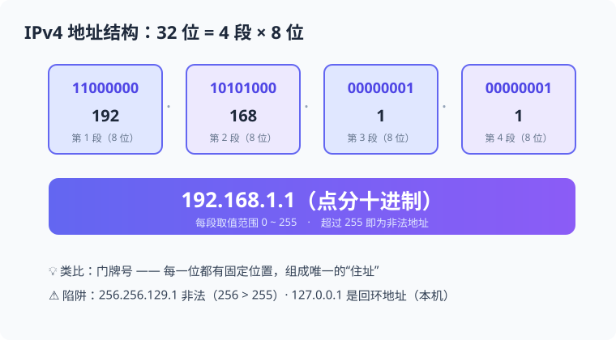
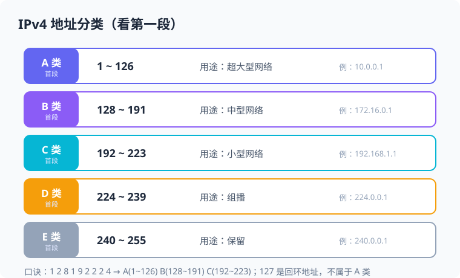
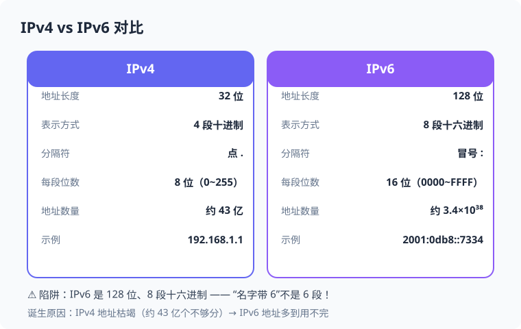

# 📖 IP 地址 ｜ 知识点精讲课

> **适用范围：** CSP-J 初赛 · 第一章 计算机网络基础
> **授课时长：** 约 40 min
> **核心考点：** IPv4 结构 · IP 地址分类 · 特殊地址（回环/私有） · IPv4 vs IPv6 对比

---

## 目录

- [Part 1：IP 地址是什么](#part-1ip-地址是什么≈10min)
- [Part 2：IPv4 地址分类（A/B/C/D/E）](#part-2ipv4-地址分类ab-cde≈15min)
- [Part 3：特殊 IP 地址（回环 / 私有）](#part-3特殊-ip-地址回环--私有≈8min)
- [Part 4：IPv4 vs IPv6 对比](#part-4ipv4-vs-ipv6-对比≈7min)
- [🧠 课堂速记要点](#🧠-课堂速记要点)
- [📋 速查答案记忆卡](#📋-速查答案记忆卡)
- [附录：板书建议 & 讲解节奏](#附录板书建议--讲解节奏)

---

## Part 1：IP 地址是什么（≈10min）

### 1.1 为什么需要 IP 地址？

> 💡 **IP 地址 = 网络世界里的"门牌号"**。每台连入互联网的设备都需要一个唯一地址，数据包才能准确送达。

**类比：**
- 寄快递需要收件人地址 → 发数据包需要目的 IP 地址
- 一个 IP 地址唯一标识一台主机（设备）

```
寄快递：  你  →  快递单（收件地址）  →  快递员  →  收件人
发数据：  电脑 →  数据包（目的IP）   →  路由器  →  目标主机
```

> ⚠️ **注意：** IP 地址是**逻辑地址**（软件层面），与网卡 MAC 地址（物理地址，硬件出厂自带）不同。



**IPv4 地址结构示意**（32 位 = 4 段 × 8 位，点分十进制）

### 1.2 IP 地址的形式

**IPv4 地址：32 位二进制，写成 4 段十进制（点分十进制）**

```
二进制：11000000 10101000 00000001 00000001   ← 32 位
十进制：192      168      1        1
写作：  192.168.1.1                            ← 点分十进制
```

| 术语 | 含义 | 说明 |
|------|------|------|
| 位（bit） | 二进制的一位 | IPv4 共 32 位 |
| 段（octet） | 8 位一组 | 共 4 段，每段取值 **0~255** |
| 点分十进制 | 用点分隔的十进制写法 | 如 `192.168.1.1` |

> ⚠️ **易错点：** 每段范围是 **0~255**。`256.256.129.1` 这种就是**非法地址**（真题必考陷阱！）。

### 1.3 真题示例

> **【2022 CSP-J 改编】** 下列几个 32 位 IP 地址中，书写错误的是（ ）。
> A. 162.105.135.27　B. 192.168.0.1　C. 256.256.129.1　D. 10.0.0.1

**解析：** IPv4 地址每段必须是 **0~255** 的十进制数。C 选项出现了 **256**，超出范围，书写错误。

> 答案：**C**

### 1.4 IP 地址和域名的关系

> 💡 **IP 地址是"门牌号"，域名是"名字"。** 数字难记、名字好记，DNS 负责两者之间的"翻译"。

**为什么需要域名？**

- IP 地址是一串**数字**，如 `192.168.1.1`，人脑很难记
- 域名（Domain Name）是一串**有意义的字符**，如 `www.baidu.com`，对人友好
- 类比：手机通讯录 —— 号码（IP）记不住，存成联系人名字（域名）就好找

```
手机通讯录:   张三  →  138xxxx5678         ← 名字对应号码
网络世界:    www.baidu.com → 110.242.68.66  ← 域名对应 IP
```

**DNS —— 域名系统（核心考点）**

> DNS（Domain Name System，域名系统）的作用：**把域名解析成 IP 地址**，相当于"网络世界的电话簿"。

**访问网站的过程：**

```
① 输入域名        www.baidu.com
② DNS 服务器查询  →  得到 IP: 110.242.68.66   ← 域名系统"翻译"
③ 浏览器向该 IP 发出请求
④ 服务器返回网页内容
```

**域名与 IP 的对应关系：**

| 关系 | 说明 | 例子 |
|------|------|------|
| 一个域名 → 一个IP | 常规情况 | `www.baidu.com` → 110.242.68.66 |
| **多个域名 → 同一个 IP** | 虚拟主机：一台服务器托管多个网站 | 多个网站指向同一台服务器 |
| IP 不变，域名可换 | 换域名不用换服务器 | 网站改名后仍指向同一 IP |

> ⚠️ **易错陷阱：**
> - "域名就是网址" ❌ 网址 = 协议 + 域名 + 路径，如 `https://www.baidu.com/index.html`
> - "DNS 负责存储网页内容" ❌ DNS 只做"翻译"，不存网页
> - "有了域名就不需要 IP 了" ❌ 最终通信仍靠 IP，域名只是给人看的

**真题示例：**

> **【CSP-J 改编】** 在域名系统中，域名与 IP 地址的关系是（ ）。
> A. 一一对应　B. 一个域名只能对应一个 IP，一个 IP 也只能对应一个域名
> C. 一个 IP 地址可以对应多个域名　D. 域名与 IP 地址没有任何关系

**解析：** 一台服务器（一个 IP）可以同时托管多个网站（多个域名），所以**一个 IP 可以对应多个域名**，即"多对一"关系，选 C。

> 答案：**C**

> **【CSP-J 真题改编】** DNS 服务器的作用是（ ）。
> A. 存储网页内容　B. 将域名解析为 IP 地址
> C. 为计算机分配 MAC 地址　D. 负责数据的加密传输

**解析：** DNS（Domain Name System）是**域名系统**，核心功能就是把域名"翻译"成对应的 IP 地址，类似电话簿。A 是 Web 服务器的事，C 是 ARP/网卡的事，D 是加密协议的事。

> 答案：**B**

> **【过程排序题】** 小丘在浏览器地址栏输入 `www.baidu.com` 后回车，正确的访问顺序是（ ）。
> ① 浏览器向 DNS 服务器查询域名对应的 IP 地址
> ② 浏览器向目标 IP 地址发送请求，接收网页内容
> ③ 浏览器解析并显示网页
> ④ 用户在地址栏输入域名并按回车
> A. ④①②③　B. ④②①③　C. ①④②③　D. ④③①②

**解析：** 先输入域名（④）→ 查 DNS 得到 IP（①）→ 向该 IP 发请求（②）→ 显示网页（③），顺序为 **④①②③**。

> 答案：**A**

---

## Part 2：IPv4 地址分类（A/B/C/D/E）（≈15min）

### 2.1 为什么分类？

> 早期网络按规模把 IP 分成 A/B/C 三类，**A 类给超大型网络（国家/骨干网），B 类给中型网络（学校/企业），C 类给小型网络（局域网）**。分类看**第一段的取值范围**。

```
┌────────┬─────────────────┬─────────────────────┐
│  类别  │  第一段范围      │  网络号/主机号划分   │
├────────┼─────────────────┼─────────────────────┤
│  A 类  │   1 ~ 126       │  网络(1字节) 主机(3字节) │
│  B 类  │   128 ~ 191     │  网络(2字节) 主机(2字节) │
│  C 类  │   192 ~ 223     │  网络(3字节) 主机(1字节) │
│  D 类  │   224 ~ 239     │  组播地址             │
│  E 类  │   240 ~ 255     │  保留（研究用）        │
└────────┴─────────────────┴─────────────────────┘
```



**五类地址速查图**（看第一段定类别）

### 2.2 ⭐ 分类速记表（核心必背）

| 类别 | 第一段范围 | 用途 | 网络号 | 主机号 | 举例 |
|:---:|:---:|------|:---:|:---:|------|
| **A** | 1 ~ 126 | 超大型网络 | 1 字节 | 3 字节 | `10.0.0.1` |
| **B** | 128 ~ 191 | 中型网络 | 2 字节 | 2 字节 | `172.16.0.1` |
| **C** | 192 ~ 223 | 小型网络 | 3 字节 | 1 字节 | `192.168.1.1` |
| **D** | 224 ~ 239 | 组播（多播） | — | — | `224.0.0.1` |
| **E** | 240 ~ 255 | 保留 | — | — | `240.0.0.1` |

> ⭐ **速记口诀：** **"1 2 8 1 9 2 2 2 4"**
> - A 类看第一段：**1~126**（1 开头）
> - B 类：**128~191**（128 开头）
> - C 类：**192~223**（192 开头）
> - 127 是"坑"——它不属于 A 类，是**回环地址**（见 Part 3）！

### 2.3 常见考题模式

**① 判断类别：** `192.168.1.1` 属于哪类？→ 第一段 192 → **C 类** ✅

**② 找非法地址：** 哪段超 255？→ 直接排除

**③ 网络号/主机号：** C 类地址前 3 字节是网络号，后 1 字节是主机号

> ⚠️ **易错提醒：** 判断类别**只看第一段**！`192.168.x.x` 是 C 类，不是"局域网专用类"——它是 C 类里的**私有地址**（见 Part 3）。

### 2.4 真题示例

> **【CSP-J 真题改编】** `172.16.0.1` 属于哪一类 IP 地址？（ ）
> A. A 类　B. B 类　C. C 类　D. D 类

**解析：** 第一段是 **172**，落在 B 类范围 **128~191**，所以是 **B 类**地址。

> 答案：**B**

---

## Part 3：特殊 IP 地址（回环 / 私有）（≈8min）

> ⚡ 本节是**判断题+选择题双料高频考点**，务必记牢三个特殊地址。

### 3.1 回环地址（Loopback）

| 地址 | 含义 | 作用 |
|:---:|------|------|
| **127.0.0.1** | 回环地址 | 代表**本机自己**，用于本机自测 |

- `ping 127.0.0.1` 能通 → 本机网卡/协议栈正常
- 127.x.x.x **整个段**都是回环地址，但最常见写 `127.0.0.1`
- ⚠️ 它不是"互联网上的一台服务器"！(真题陷阱)

### 3.2 私有地址（Private Address）

> 私有地址**只能在局域网内使用**，不能直接在公网上路由。公网访问不到私有地址。

| 类别 | 私有地址段 | 常见场景 |
|:---:|:---:|------|
| A 类 | **10.0.0.0 ~ 10.255.255.255** | 大型企业内部网 |
| B 类 | **172.16.0.0 ~ 172.31.255.255** | 中型企业 |
| C 类 | **192.168.0.0 ~ 192.168.255.255** | 家庭/小办公室路由器 |

> ⭐ **速记：** **10 开头、172.16~31、192.168** 都是私有地址，局域网专用。

### 3.3 对照表：普通地址 vs 特殊地址

| 地址 | 类型 | 能不能上公网 |
|------|------|:---:|
| `127.0.0.1` | 回环（本机） | ❌ |
| `10.0.0.1` | A 类私有 | ❌ |
| `192.168.1.1` | C 类私有 | ❌ |
| `162.105.135.27` | 公网地址 | ✅ |
| `223.5.5.5`（阿里 DNS） | 公网地址 | ✅ |

### 3.4 真题示例

> **【CSP-J 改编】** 下列关于 IP 地址的说法，正确的是（ ）。
> A. 127.0.0.1 是互联网上一台真实服务器的地址
> B. IPv4 地址由 4 段十进制数组成，每段取值范围是 0~255
> C. IPv6 地址的长度是 32 位
> D. 192.168.x.x 属于公网地址，可以直接在互联网上访问

**解析：** - A ❌：127.0.0.1 是**回环地址**，代表本机
- B ✅：IPv4 = 4 段 × 0~255 ✅
- C ❌：IPv6 是 **128 位**（见 Part 4）
- D ❌：192.168.x.x 是**私有地址**，局域网专用

> 答案：**B**

---

## Part 4：IPv4 vs IPv6 对比（≈7min）

> 只需记住核心属性对比。

### 4.1 为什么要有 IPv6？

IPv4 只有 32 位 → 约 43 亿个地址，**早已分配殆尽**（地址枯竭）。IPv6 应运而生。

### 4.2 核心对比表

| 对比项 | IPv4 | IPv6 |
|:---:|:---:|:---:|
| 地址长度 | **32 位** | **128 位** |
| 表示方式 | 4 段十进制（点分） | **8 段十六进制（冒号分隔）** |
| 示例 | `192.168.1.1` | `2001:0db8:85a3:0000:0000:8a2e:0370:7334` |
| 地址数量 | 约 4.3×10⁹ | 约 3.4×10³⁸ |
| 每段位数 | 8 位（0~255） | 16 位（0000~FFFF） |
| 是否 NAT | 需要（私有地址转换） | 基本不需要 |
| 安全性 | 较弱（可选） | 内置 IPSec |

> ⭐ **速记口诀：** **"32 变 128，十进制变十六进制，点变冒号"**



**IPv4 vs IPv6 核心对比图**

### 4.3 易错陷阱（真题最爱）

| 陷阱说法 | 正解 |
|------|------|
| "IPv6 地址长度是 32 位" | ❌ 是 **128 位** |
| "IPv6 用 6 段十六进制表示" | ❌ 是 **8 段**（名字带 6 是陷阱！） |
| "IPv6 与 IPv4 位数相同" | ❌ 128 ≠ 32 |
| "IPv6 每段 8 位" | ❌ 每段 **16 位** |

### 4.4 真题示例

> **【CSP-J 真题】** IPv4 协议使用 32 位地址，随着地址资源日趋枯竭，正逐渐被使用（ ）位地址的 IPv6 协议所取代。
> A. 40　B. 48　C. 64　D. 128

**解析：** IPv6 地址长度为 **128 位**（16 字节），地址空间约为 IPv4 的 2⁹⁶ 倍，彻底解决地址枯竭问题。

> 答案：**D**

---

## 🧠 课堂速记要点

1. IP 地址 = 网络世界的"门牌号"，IPv4 共 **32 位**、4 段、每段 **0~255**
2. 分类看第一段：**A(1~126) B(128~191) C(192~223) D(224~239) E(240~255)**
3. **127.0.0.1 = 回环地址 = 本机自己**，不是公网服务器
4. 私有地址三兄弟：**10.x、172.16~31.x、192.168.x** —— 局域网专用，上不了公网
5. IPv6 = **128 位、8 段十六进制、冒号分隔**；IPv4 = 32 位、4 段十进制、点分隔
6. 非法地址特征：**任一段超过 255**（如 256.256.129.1）

---

## 📋 速查答案记忆卡

```
IPv4 长度    ├→ 32 位
IPv6 长度    ├→ 128 位
A 类首段     ├→ 1~126
B 类首段     ├→ 128~191
C 类首段     ├→ 192~223
回环地址     ├→ 127.0.0.1（本机）
私有地址     ├→ 10.x / 172.16~31.x / 192.168.x
IPv4 写法    ├→ 点分十进制（192.168.1.1）
IPv6 写法    ├→ 冒号十六进制 8 段
非法地址特征  ├→ 段值 > 255
DNS 的作用   ├→ 域名 → IP
域名与 IP 关系 ├→ 多对一（一个 IP 可对应多个域名）
```

---

## 附录：课堂板书建议（老师参考）

### 白板布局

```
┌─────────────────────────────────┬─────────────────────────────────┐
│        IP 地址结构               │        IPv4 分类               │
│  192.168.1.1                     │  A: 1~126    B: 128~191        │
│  = 4 段 × 8 位 = 32 位           │  C: 192~223  D: 224~239        │
│  每段 0~255                      │  E: 240~255                    │
├─────────────────────────────────┼─────────────────────────────────┤
│        特殊地址                  │        IPv6                    │
│  127.0.0.1 → 本机（回环）        │  128 位 = 8 段十六进制          │
│  10.x / 192.168.x → 私有         │  2001:0db8:...:7334             │
│  256.x.x.x → 非法                │  32位 → 128位（解决枯竭）       │
├─────────────────────────────────┴─────────────────────────────────┤
│   总结：门牌号 → 分类看首段 → 特殊地址三条 → IPv6 128 位          │
└───────────────────────────────────────────────────────────────────┘
```

### 建议讲解节奏

| 阶段 | 时间 | 内容 |
|------|:----:|------|
| Part 1 IP 地址是什么 | 10min | 门牌号类比 + 32 位结构 + 0~255 陷阱 |
| Part 2 地址分类 | 15min | 五类首段范围 + 口诀 + 判断练习 |
| Part 3 特殊地址 | 8min | 回环 127 与私有三兄弟 + 判断题 |
| Part 4 IPv4 vs IPv6 | 7min | 对比表 + 陷阱辨析（128 位/8 段） |
| 课堂速记 + 总结 | 5min | 易错点强调 + 速查卡背诵 |

---

> 📖 **课件编号：** 8_1_3
> 📅 **日期：** 2026-08-01
> ✍️ **制作者：** ⛰️ 丘
